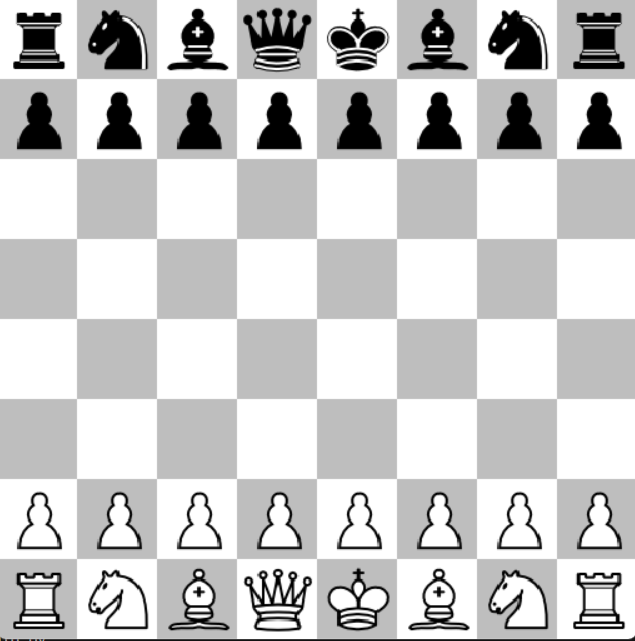

# Chees.py
This program allows users to play chess by interacting with a graphical user interface. The code handles various aspects of the game, including board visualization, piece movement, and user input processing. Let's explore the main features and functionalities of this chess program. This program was carried out in collaboration with a team and the support of our teacher. I was in charge of implementing PyGame for the visualization of the game, the images used are free to use and I also collaborated in the development of the movement of the tower.

# Python Chess Game



## Table of Contents

- [Introduction](#introduction)
- [Key Features](#key-features)
- [Getting Started](#getting-started)
  - [Prerequisites](#prerequisites)
  - [Installation](#installation)
- [How to Play](#how-to-play)

## Introduction

Welcome to the Python Chess Game, a simple yet interactive chess application built using Python and the Pygame library. This game allows you to play chess against an AI opponent on a graphical chessboard.

## Key Features

- Graphical chessboard with intuitive piece movements.
- Interactive user interface for piece selection and move input.
- Support for undoing moves (Press 'z' key).
- Visual indication of available moves for selected pieces.
- Check and checkmate detection.
- Designed to be a fun and educational tool for chess enthusiasts of all levels.

## Getting Started

### Prerequisites

Before you begin, ensure you have met the following requirements:

- Python 3.x installed on your system.
- Pygame library installed. You can install it using `pip`:
  ```bash
  pip install pygame
  ```

### Installation
- Clone the repository:
```bash
git clone https://github.com/yourusername/python-chess-game.git
```
- Navigate to the project directory:
```bash
cd python-chess-game
```
- Run the game:
 ```bash
cd python-chess-game
```

## How to play
- Launch the game by running chess_game.py.
- Click on a chess piece to select it.
- Click on the destination square to make a move.
- Use the 'z' key to undo a move.

## Game Controls
- Click: Select a piece or move a piece.
- 'z' Key: Undo the last move.
  
